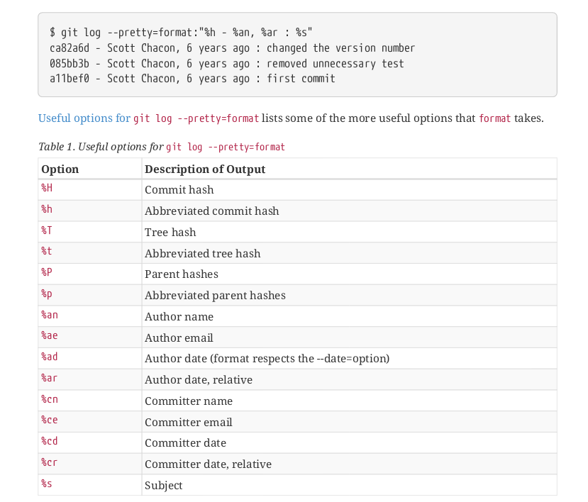
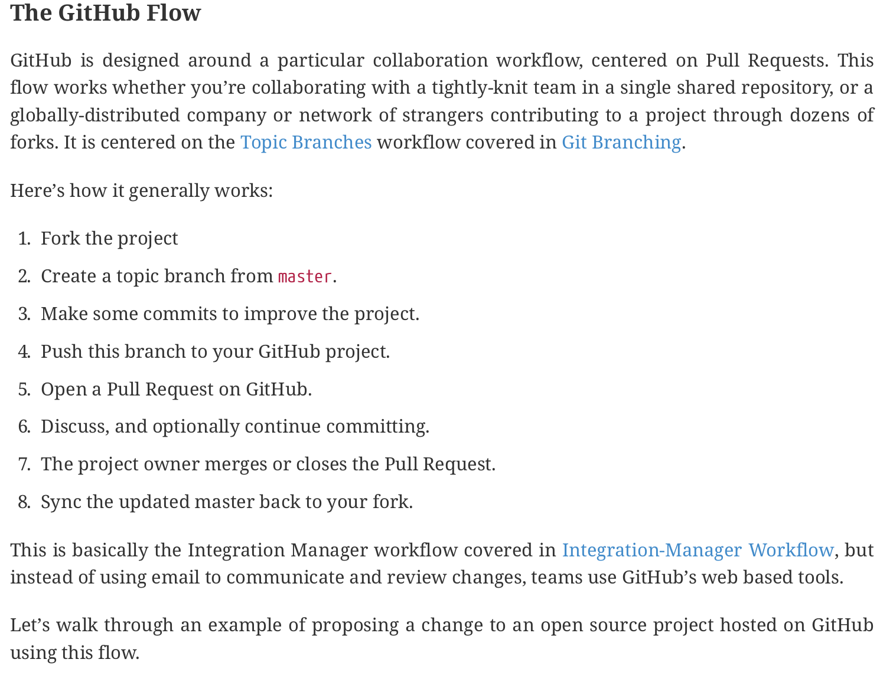
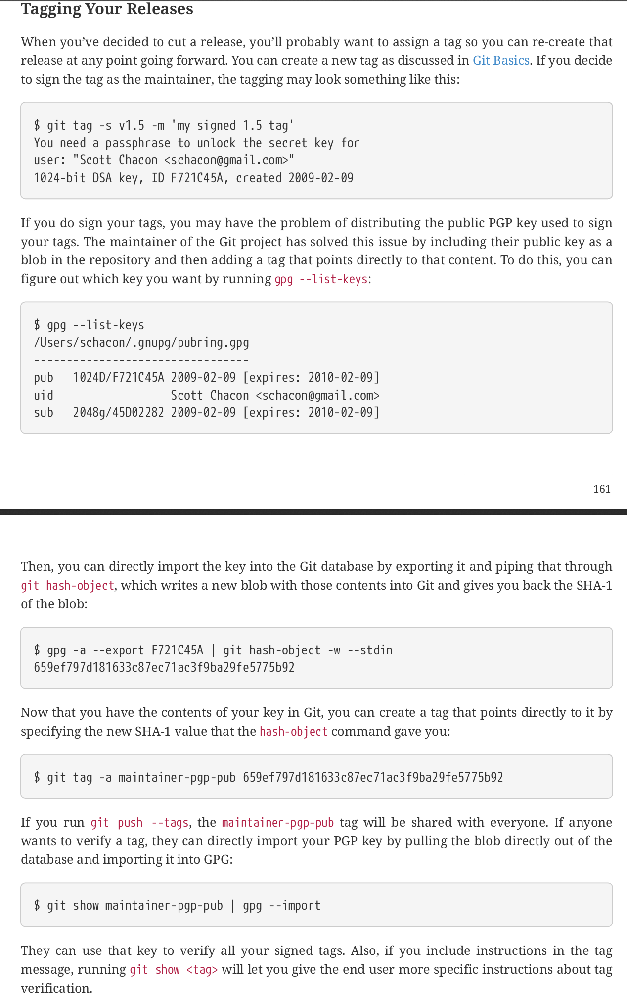
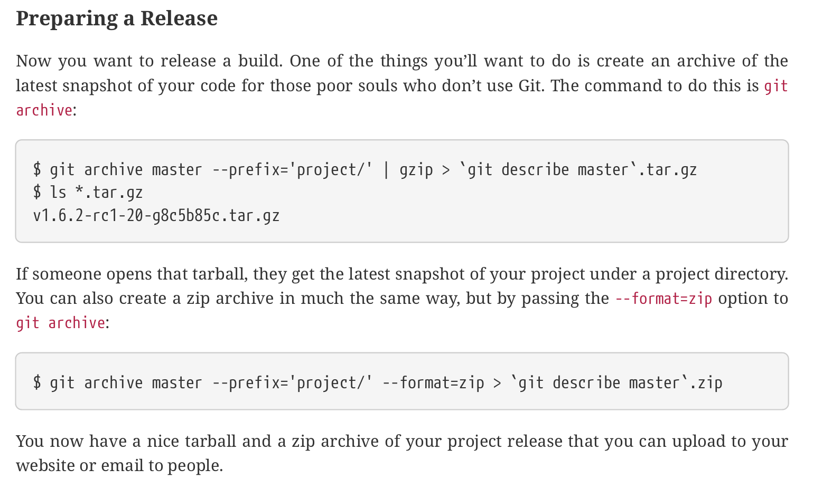

# **Overview**

# **Basic**

## 1. <a href="#1">Git configuration</a>
## 2. <a href="#2">Git basics</a>
- ## <a href="#3">Create git repository</a>
- ## <a href="#4">Stage files / Unstage files</a>
- ## <a href="#5">Creating a new commit from staged files</a>
- ## <a href="#6">Ignore files or folders</a>
- ## <a href="#7">Tags</a>
- ## <a href="#8">Show changes since last commit</a>
- ## <a href="#9">Remove or modify files</a>
- ## <a href="#10">Show commit history</a>
- ## <a href="#11">Undo things</a>
- ## <a href="#12">Remote repositories/servers (Github/Gitlab/Bitbucket/...)</a>
 
## 3. <a href="#300">Branching</a>

# **Advanced**

## 4. [Hosting your own Server](#Hosting-your-own-server)
## 5. [Contributing to a project](#Contributing-to-a-project)
## 6. [Maintaining a project](#maintaining-a-project)
## 7. [Git Tools](#Git-tools)
- ## [Changing old commits ](#Change-old-commits)
- ## [Advanced_Merging](#advanced-merging)
- ## [Git_Debugging](#Git-debugging)
## 8. [Git configuration options](#git-configuration-options)
## 9. [Git attributes](#Git-attributes)

## To get help use these commands:
**git help < command >** 
**git < command > --help **
**man git** 

For a simple overview: **git < command > -h**

File States:
working files - staged files - commited files

Documentation build from the book pro git. Get additional information from there or the official git documentation

# **General information**

- Git add stages files, which means git "marks" them to be in the next commit
- Git saves every state of files every time you commit.
- Git uses a pointer called HEAD to point to the commit currently at
- The checkout command moves the HEAD pointer to a specific commit

# **Git configuration**
### **Show all applied configurations with their origins**

    git config --list --show-origin

git stores its config in 3 different ways: system wide (--system), user wide (--global) and local (--local), which means project wide.
On Linux, the paths to these files are: 
system wide: /etc/gitconfig  
user wide: ~/.gitconfig or ~/.config/git/config 
Project wide: Project/.git/config 

### **Set user name**

    git config --global user.name "User Name"

sets user name to "User Name" globally

### **Set email**

    git config --global user.email "username@example.com"

### **Set git used editor**

    git config --global core.editor vim

sets the core editor for git to vim

### **Set merge/diff tool used to show conflicts/diff**

    git config --global merge.tool < mergetool >
    git config --global diff.tool < diff tool >

### **Auto convert Windows CRLF (Carriage return + Line Feed "\r\n") to Unix LF ('\n') only**

    git config --global core.autocrlf input

# **Git basics**

## **Create git repository**

### Initialize git project at current path

    git init

### Clone existing git project to current path

    git clone < url > < destination >

clone git project from url to destination path  
example: git clone https://github.com/libgit2/libgit2 
clones libgit2 project

## **Stage or Unstage files**

### Stage files

    git add < file/directory >

starts to stage the file/s or files in a directory

### Unstage file

    git reset -- < file >

or

    git reset HEAD < file >

### Unstage all files

    git reset

### Check status of staged and unstaged files

    git status

## **Creating a new commit from staged files**

    git commit

or

    git commit -m "commit-message"

### Skipping the staging area / staging all staged files and committing them

    git commit -a

### Redo/Replace last commit
If you forgot to stage a file to a commit or want to change the commit message, its possible to do so with this command:

    git commit -amend

This only makes sense, if you add your forgotten file etc. first

## **Ignore files or folders**

It's almost always a good idea to let git ignore certain files.
A good example are all files in the build directory. 
To let git ignore specific files, a .gitignore file in necessary.

Example .gitignore file:

    build/
    bin/
    *.a
    *.o
    *.so
    /TODO

/TODO ignores only the TODO file in the current directory 
build/ and bin/ ignores all files in these directories 
There are many examples for gitignore files available on github: 
https://github.com/github/gitignore

## **Tags**
Git also supports tags, which is often used for versions

### List tags

    git tag

### Filter git tag

    git tag -l "V1.1*"

lists all tags starting with "V1.1"

### Creating a tag

    git tag -a V1.1.0 -m "Version 1.1.0"

creates an annotated tag called V1.1.0 with the message "Version 1.1.0"

### Inspect tag

    git show < tagname >

Shows information about tag

### Tag commit later

    git tag -a < tagname > < commit_checksum >

Example:

    git tag -a V1.3.5 9fgh

adds tag V1.3.5 to commit with commitchecksum 9fgh...

### Delete tag

    git tag -d < tagname >

To delete it from the remote repo

    git push < remote > --delete < tag >

### Push tags to remote repo
Unfortunately tags do not get transferred automatically when pushing to a repo, so you have to do it with this command

    git push < remote > --tags

### Checkout Tag files

    git checkout 2.0.0

If you do this, git is in detached HEAD state and you should only commit to a new 

    git checkout -b new_branch v2.0.0

Now you can make commits to the old files

## **Show changes since last commit**

### Show unstaged changes

    git diff

### Show staged changes

    git diff --staged

## **Remove or modify files**

### Removing files

    rm < file >
    git rm < file >

removes file from working directory and stages the removal

### Removing staged files

If a file was already staged, but you still want to remove it, you have to force (-f) the removal

    rm < file >
    git rm -f < file > 

### Remove file from git, but not delete it (let git ignore it)

    git rm --staged < file >

### Renaming files
If you rename a file, but dont tell git, it will detect a deleted file and a newly created one, but you can either do that and git rm the old name and git add the new one or use the git mv command instead

    git mv README.md README

or

    mv README.md README.md
    git rm README.md
    git add README

## **Show commit history**

    git log

### View commit history with entire difference

    git log -p

### View commit history with abbreviated difference

    git log --stat

### Custom commit history format

    git log --pretty=format: "%h - %an, %ar : %s"

### Filter git log
There are many other useful options, that can be used with git log.
One particular useful is -S which takes a string and only shows commits where the number of occurences of this string changed.

    git log -S function_name

## **Undoing things**

### Revert changes from file to last commit( NOT RECOMMENDED )

    git checkout -- < file >

### Revert all changed from all files to the last commit (NOT RECOMMENDED)

    git reset --hard HEAD

**IMPORTANT: the changes made are not saved, because git only makes backups of commited changes**

### **Tags**
Git also supports tags, which is often used for versions

### List tags

    git tag

### Filter git tag

    git tag -l "V1.1*"

lists all tags starting with "V1.1"

### Creating a tag

    git tag -a V1.1.0 -m "Version 1.1.0"

creates an annotated tag called V1.1.0 with the message "Version 1.1.0"

### Inspect tag

    git show < tagname >

Shows information about tag

### Tag commit later

    git tag -a < tagname > < commit_checksum >

Example:

    git tag -a V1.3.5 9fgh

adds tag V1.3.5 to commit with commitchecksum 9fgh...

### Delete tag

    git tag -d < tagname >

To delete it from the remote repo

    git push < remote > --delete < tag >

### Push tags to remote repo
Unfortunately tags do not get transferred automatically when pushing to a repo, so you have to do it with this command

    git push < remote > --tags

### Checkout Tag files

    git checkout 2.0.0

If you do this, git is in detached HEAD state and you should only commit to a new 

    git checkout -b new_branch v2.0.0

Now you can make commits to the old files

## **Remote repositories/servers**

You can connect your git project to remote servers to use them as host, centralized storage or backup 
The most common ones are GitHub/Bitbucket/Gitlab

### List remote repositories/servers

    git remote

Show more information with the -v argument

### Inspect remote

    git remote show < remotename >

### Add new remote

    git remote add < remotename > < url >

### Rename remote

    git remote rename < old_name > < new_name >

### Remove remote

    git remote rm < remotename >

### Fetching from remote

    git fetch < remote >

fetches all files from remote to a new 

### Fetching and merging from a remote (Pulling)

    git pull < remote > < branch >

### Pushing to a remote

    git push < remote > < branch >

**Example**

    git push github master

### **Aliases**
In git its possible to create aliases for commands

    git config --global alias.ci commit

This creates the alias ci for commit, so git ci would be the same as git commit

# **Branching**

A branch is used to split a project to different developement states 
The master branch is the default main branch

### Show all branches

    git branch

Use -v option to see the last commit for each branch

### Create a new branch 

    git branch testing

### Show commits and branches

    git log --oneline --decorate

### Switch to a different branch

    git checkout < branch >

### Create a branch and switch to it

    git checkout -b < new_branch >

### Delete branch

    git branch -d < branch >

### Merge current branch with another branch

    git merge < branch >

### Merge conflicts
When you merge two branches that both change the same file, git pauses the merge and asks you to resolve the conflict to continue the merge.

There are many tools to resolve this problem visually ( for example git mergetool)

### Show branches, that are merged or not merged to current branch

    git branch --merged

    git branch --no-merged

### Create a tracking branch

    git checkout --track github/serverfix

creates a new local branch called serverfix, which tracks the branch github/serverfix

### Set a tracking branch 

    git branch -u github/serverfix

tracks the github/serverfix branch from the current branch regardless of the name etc.

### Show tracked branches

    git branch -vv 

shows local branches and their tracked branches

### Delete remote branch
if you dont need a remote branch anymore, for example you worked on a hotfix with multiple people on the branch github/hotfix and you have fetched and merged the latest changes, you can delte it with this command

    git push github --delete hotfix

### Rebasing
Rebasing is very similar to merging, in fact it merges two different commits into one just like merging, but it "removes" one of them completely and its history looks line a linear non paralell developement

    git rebase master experimental

merges experimental and master onto master linear history and hides/removes experimental parallel history

after a rebase, you should merge the rebased branch into the master branch

    git checkout master
    git merge experimental

**IMPORTANT: Only rebase work, you haven't pushed to a remote branch yet**

# **Hosting your own server**

Described in the book Pro Git in the chapter called: Git on the Server

# **Contributing to a project**

### **Guidelines**

Before contributing to any public project, you should read their guidelines on code and documentation, if they have one. 

You should also check for whitespace errors. This can be checked before a commit via this command:

    git diff --check

Also try to make one commit per changed feature, bugfix, etc. Dont work on your branch for a long time and commit everything at once.

The commit message should consist of a one-line summary and a text block, which further describes the commit.

### Contribute to Github repository or similar

### Pull request via git commands

    git request-pull < pull-destination-branch > < pull-source-branch >

Example:

    git request-pull origin/master forked_project

# **Maintaining a project**

### Apply a patch

    git apply < patchfile >

Example:

    git apply ~/Downloads/patch-ruby-client2.patch

To check if a patch applies cleanly before applying

    git apply --check < patchfile >

After applying with git apply, you still have to stage and commit the changed files

**IMPORTANT: git apply should only be used, when git am is not working, because the patch wasnt generated with the format-patch command**

### Using git am to patch

    git am < patchfile >

git am automatically stages and commits the changes

### Pull from forked remote repository without adding it

    git pull < ulr >

this should only be used, if the remote repository is forked from the current branch and is already debugged etc.

### View commits in this branch but not in another

    git log experimental --not master

shows commits in experimental, which are not in the master branch

### Compare/Diff topic branch with common ancestor master branch

    git diff master...experimental

### Cherry pick a specific commit to merge with the master branch

    git checkout master
    git cherry-pick < commitchecksum >

This cherry picks a specific commit from a topic branch and rebases it with the master branch

### Tagging a release 

### Generating a build number for releases

    git describe master

This command outputs a string containing the latest tag + numbers of commits since then + a unique sha1 number

Example output: v0.1.0-1-g8c5b75h

### Archive/Prepare a release

Uses git archive

### Overview/Shortlog of commits since a release

    git shortlog --no-merges master --not v1.0.1

Shows a summary of commits since v1.0.1

### Workflows for maintaining a project

The easy way is to have one master branch, which you could merge with topic branches that are validated and tested.

Another safer way is to have two main branches one master and one develop where new topic branches are firstly merged with the develop branch

There are other workflows described in the Pro Git book.

# **Git Tools**

### **Refer to commits via SHA-1 hash**

Every commit can be referred to with its hash or the first few character of this hash as long as its unambiguous

Example

    git show 1c002dd4b536e7479fe34593e72e6c6c1819e53b

works the same as

    git show 1c002d

### Refer to latest commit of a branch

    git show experimental

Refers to the latest commit of the experimental branch

To see the SHA-1 Hash of this commit, use this command

    git rev-parse experimental

### Show last HEAD values

    git reflog

### Show parent of current HEAD commit

    git show HEAD^

The ^ symbol, acts as "parent of" and can be extended by a number after the symbol to get the n'th number of parent

Example

    git show d921970^2

Get 2nd parent of commit d921970

### Show first parent of first parent

    git show HEAD~²

The ~ symbol always shows the first parent, so ~2 means the parent of the parent not the 2nd parent

### Show every commit from a branch that is not yet in another branch

    git log master..experimental

Shows all commits from the experimental branch, that are not in the master branch

Other Example:

    git log github/master..HEAD

shows all commits, that would be pushed to the github/master branch if you would push

### Show every commit from multiple branches, that are not yet in another branch

    git log experimental experimental2 hotfix01 --not master

### Show all commits that not in both branches

    git log master...experimental

To have a clearer view of this, use

    git log --left-right master...experimental

This also shows which commit is from which branch

### **Interactive staging**

    git add -i

Starts the interactive staging mode

### **Save (Stash) unfinished work before committing**

    git stash

This only stashes the modified and staged tracked files. 
To also stash the untracked files, use

    git stash --include-untracked

### Show stashed work

    git stash list

### Load stashed work

    git stash apply

or

    git stash apply --index

To also reapply the staging

or

    git stash pop

To apply the work and remove the stashed entry

### Remove saved(stashed) work

    git stash drop

### Create Branch from stashed work

    git stash branch < branchname >

### **Clean/remove unnecessary files**

    git clean

git clean removes every file, that is untracked, but not ignored
to do the same for every subdirectory, run

    git clean -f -d

You can also use the -n argument to see, which files will be removed before doing so

To also remove ignored files, use the -x option

For example

    git clean -f -d -x

removes every untracked and ignored file from this and subdirectories

### **Signing work**

### Signing tags
To sign your work with tags, you need a gpg key.
use gpg --list-keys to see your keys

If you need a new one, use gpg --gen-key to generate a new one

To sign a tag, use the -s option while creating it

    git tag -s v1.0.5 -m "signed v1.0.5"

### Verifying tags

    git tag -v < tag >

This outputs whewther or not and from who this tag is signed.#
You need the signers public key in your keyring to do so!

### Signing commits

    git commit -a -S -m "signed commit"

### Verifying commits

    git log --show-signature -1

You can also sign merge commits with the -S option
Also by using --verify-signatures with the git merge command, it only merges, if all commits are signed

**IMPORTANT: Only use signing, when every contributer also does**

### **Search through files**

Search for string in files

    git grep -n std::cout

Search for string "std::cout" in files and show found files with line num etc.

### Search for occurance of string in commits

    git log -S < string > --oneline

Shows all commits where a diff or filename contains the string

### Show lifetime of a function with every commit it was changed

    git log -L :get_character:main.cpp 

Searches commits for changes is the get_character function in main.cpp

# **Change old commits**

### Change older commit messages

    git rebase -i HEAD~3

change the commit messages of the last 4 commits
this starts your editor with the commits and a word in front of it, for example pick, which does nothing. Change this word to what you want to change the commit

### Squash multiple commits into one

With interactive rebasing ( git rebase -i) you can also squash commits
If you need this, look into Pro git page 255

Another way to do this is with reset

    git reset --soft HEAD~2

sets the head pointer back 2 commits
if you then commit, it essentially replaces the last 2 commits with a new one but with the same state.

### Completely change a commit

With git rebase -i you can completely change an old commit.

    git rebase -i < commithash > + 

Example:

    git rebase -i bc5jg9kl^

If you have 3 commits that look like this in the interactive rebasing menu

    pick f7f3f6d changed my name a bit 
    pick 310154e updated README formatting and added blamepick  
    pick a5f4a0d added cat-file

Change pick to edit on the commit you want to edit 
This sets you to the point after the commit was committed, so you have to reset

    git resed HEAD^

then make the changes you want, commit and *git rebase --continue*
This changes the SHA-1 hash of the commit, so don't do this with public pushed commits

### Remove a specific file from every commit

    git filer-branch --tree-filter 'rm -f password.txt' HEAD

This removes the password.txt file from every commit in the current branch. 
Use --all to do this in every branch

### Git reset

there are 3 ways to reset

    git reset --soft

,

    git reset

and

    git reset --hard

git reset --soft only changes the head pointer to the last commit

git reset --mixed( normal rest ) also unstages every file

git reset --hard also resets the files in the working directory to the way they were before, so it discards the changes made, this is dangerous.

# **Advanced merging**

### Abort merge

    git merge --abort

### Ignore whitespace issues

    git merge -Xignore-space-change < branch to merge >

### Manual file merging

Git saves 3 states of a file while merging: file of this branch, file of the other branch and the common file.

You can get everyone of them like this

    git show :1:hello.rb > hello.common.rb
    git show :2:hello.rb > hello.ours.rb
    git show :3:hello.rb > hello.theirs.rb

this gets every state of the file hello.rb as a new file

so now you can manually change what you want and do a manual merge

    git merge-file -p hello.common.rb hello.ours.rb hello.theirs.rb > hello.rb

### Show commits that could have caused the merge conflict

    git log --oneline --left-right --merge

shows commits which changed the part of the file which has a conflict

### Undo a merge
A easy way to undo a merge that was just made is to reset --hard HEAD~ this moves the master branch and the HEAD pointer to the last commit and resets the changes made. Now you just have to commit again.

An other option is to reverse the commit

    git revert -m 1 HEAD

this keeps all changes from the parent 1, which is the parent commit of the current branch before the merge.
The problem with this is, that the now latest commit doesnt have the changes of the merge, but still thinks it has. 
If you now want to merge, you should do it with this command:

    git revert ^M

This is confusing, please read Git Pro page 290+ for this

### Choosing a favorable side to merge from

It is possible to tell git which side (this or the other branch) should be benefitted.

    git merge -Xours experimental

in this example, if there would be a merge conflict, it would just choose the current branch of changes made to merge from.

### Reuse merge conflict solutions

Git has a feature called Rerere which stands for reuse recorded resolution, which automatically reuses solutions for merge conflicts

This can be handy if you have a long lived topic branch, that you dont want to merge every now and then but only in the end to keep a clean history. With rerere you can occasionally attempt a merge, solve the conflicts and back out of the merge. Rerere then saves the conflict solutions for the next time you want to merge.

to enable rerere, run

    git config --global rerere.enabled true

# **Git Debugging**

### Search commit/committer that introduced a bug

If you know for example that in line 80 to 90 in the file car.cpp is a bug you can search through commits, that changed these line in this file

    git blame -L 80,90 car.cpp

### Find bug, that was introduced at a certain point

If you know there is a bug in this commit that wasnt there in the latest commit, you can use git bisect to find it

    git bisect start

tell bisect, that this commit has a bug

    git bisect bad

tell bisect, when the bug wasnt there

    git bisect good v1.0.1

git bisect now chooses a commit in the middle of the one with the bug and the other and checkouts to it. 
Now you can run test to determine, if the bug is in this commit. 
if not, run

    git bisect good

Now it selects a new commit again etc. 

You can do this over and over again until you find the commit with the bug.
At the end run

    git bisect reset

You can also automate git bisect like this:

    git bisect start HEAD v1.5.3
    git bisect run test-error.elif

This uses the test-error.elif executable to check wheter or not the test succeeded. The executable has to return 0 if the test was good and a different value if not.

# **Submodules**

Sometimes you want to have a project within the project, for example if your project depends on a library. 
You can either distribute the libraries with the source code or provide the clients with a list of dependencies (libraries etc.).
In git you can also use submodules.

For example if you project needs the M1Libraries, you can add the submodule like this:

    git submodule add https://github.com/mirogon/M1Libraries

this automatically clones the repository in a subfolder called like the repository.
It also creates a .gitmodules file, which contains the configuration for the submodules.

### Cloning a proiject with submodules

When you clone a project with submodules, it also clones the directories, but not the content in it. To get it, run

    git submodule init
    git submodule update

you can also pass git clone an argument

    git clone --recurse-submodules 

which does the same

### Update submodule

    git fetch
    git merge origin/master

or

    git submodule update --remote < submodule name >

or no submodule name to update all

### Updating submodules from the project remote ( clone of the project which uses a submodule, not the project host )

    git pull
    git submodule update --init --recursive

More information on working with submodules are in the book Pro Git page 306+

# **Bundling**

You can bundle repositories, to have a whole repository in one file. 
To bundle the master branch into a file called master.bundle, run

    git bundle create master.bundle HEAD master

To unpack/unbundle the repository, use git clone

    git clone master.bundle repo

creates a repository called repo from the bundle

### Verify bundle

    git bundle verify < bundle >

shows the content and status

### Fetch/Pull from bundle

If a bundle only contains commits to merge from, you can fetch/pull from it

    git fetch < bundle > master:other-master

fetch from the bundle master branch to the other-master branch of the current repository.

# **Store git credentials in a cache for a certain time**

Sometimes it's annoying to retype your credentials every time you want to do something it git. 
For this problem, there is a feature which lets you save the credentials for a certain time in a cache(ram).

    git config --global credential.helper cache

this saves your name and password for 15minutes every time you use it.

    git config --global credential.helper 'cache --timeout 3600'

stores the credentials an hour instead of 15min.

# **Git configuration options**

**core.editor**

Default editor used by git

**commit.template**

template file which is shown while committing ( commit message )

**core.pager**

which pager git uses to show long output ( default less )

**user.signinkey**

key to use with signing things

**core.excludesfile**

path to file like .gitignore but it will be used in every project

**help-autocorrent**

if set to 1, helps with typos

**color.ui**

wheter or not to use color coded git output (true/false)

**color.***

Use color coded output or not with specific git commands ( example: git config --global color.log false)

# **Git attributes**

Git attributes are like the configuration settings, but for a proeject itself, not a system or user.

This has to be in a .gitattributes file

### Define files as binary to prevent diff output

    *.m1data binary

defines m1data files as binary

### Not export certain files to an archive

test/ export-ignore

the test folder will not be in an archive created by git archive

### Merge strategies

You can define merge strategies for certain files with attributes

example:

    global.h merge=ours

always prefers this (our) version in merge conflicts for the file global.h

